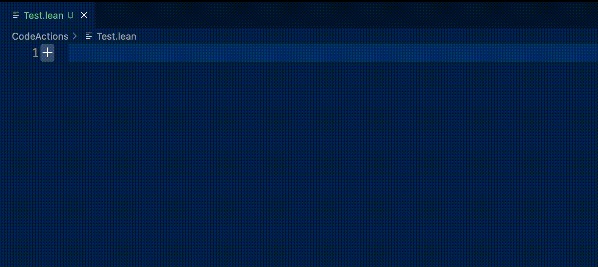
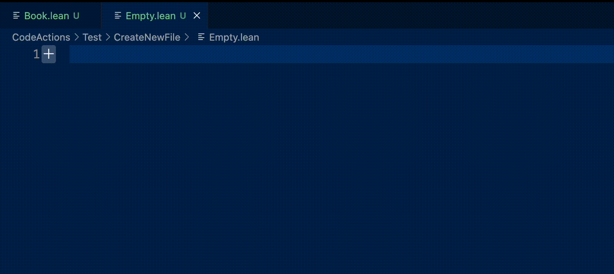
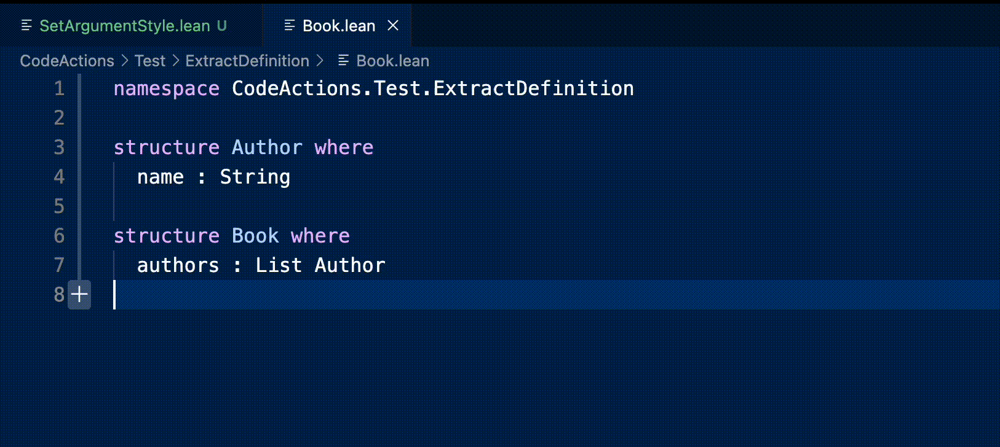
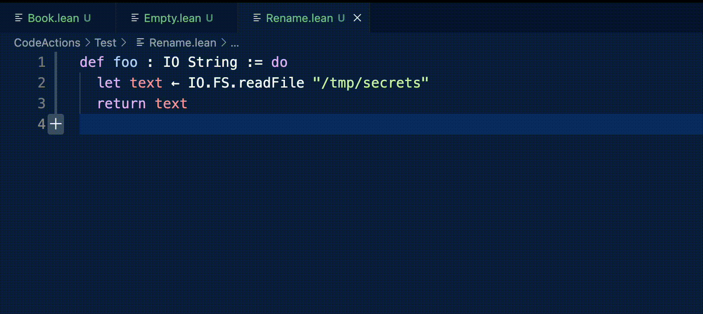
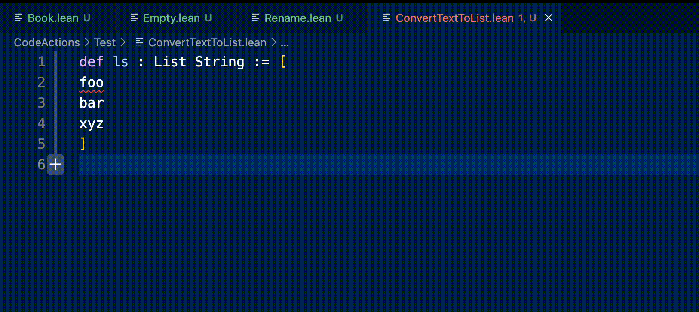

# VSCode Lean 4 Code Actions

<p align="center">
  
</p>

<p align="center" style="padding: 20px 0">
  <a href="https://marketplace.visualstudio.com/items?itemName=denis-gorbachev.lean4-code-actions&ssr=false">
    
  </a>
</p>

## Installation

* [Install the extension](https://marketplace.visualstudio.com/items?itemName=denis-gorbachev.lean4-code-actions&ssr=false)
* Add the keyboard shortcuts for [useful commands](#commands)

Note: a custom language configuration is available as [a separate extension](https://github.com/DenisGorbachev/vscode-lean4-language-configuration#readme).

## Commands

* [Create a new file](#create-a-new-file)
* [Auto-import a definition](#auto-import)
* [Extract a definition to a separate file](#extract-a-definition-to-a-separate-file)
* [Find-replace the current word within a code block](#find-replace-the-current-word-within-a-code-block)
* [Convert a text block to a list of strings](#convert-a-text-block-to-a-list-of-strings)

**Disclaimer:** the commands currently operate directly on text. As such, they have many limitations - for example, sometimes they don't properly detect Lean names. We have plans to reimplement the commands as proper code actions within LSP that operate on `Syntax` instead of text.

### Create a new file



**Before:**

(Nothing)

**After:**

File: `CodeActions/Test/CreateNewFile/User.lean`

```lean
namespace CodeActions.Test.CreateNewFile

structure User where

deriving Repr, Inhabited

namespace User
```

**Notes:**

* This command supports adding `import`, `open` and `deriving instance` commands via configuration.

**Configuration options:**

* `lean4CodeActions.createNewFile.imports` - a list of Lean filenames to be imported.
* `lean4CodeActions.createNewFile.opens` - a list of Lean namespaces to be opened.
* `lean4CodeActions.createNewFile.derivings` - a list of Lean names to be derived.

---

### Auto-import


**Before:**

```lean
def x : Rat := 1.0
```

**After:**

```lean
import Std.Data.Rat.Basic

def x : Rat := 1.0
```

**Gotchas:**

* If you execute this command with an empty selection (just a cursor on the name), then only the part captured by [`getWordRangeAtPosition`](https://code.visualstudio.com/api/references/vscode-api#TextDocument.getWordRangeAtPosition) will be used. To import a hierarchical name, select it fully, then execute the command. Alternatively, you can enable detection of hierarchical names by installing [a custom language configuration](https://marketplace.visualstudio.com/items?itemName=denis-gorbachev.lean4-language-configuration).

---

### Extract a definition to a separate file



**Before:**

File 1: `CodeActions/Test/ExtractDefinition/Book.lean`

```lean
namespace CodeActions.Test.ExtractDefinition

structure Author where
  name : String

structure Book where
  authors : List Author 
```

**After:**

File 1: `CodeActions/Test/ExtractDefinition/Book.lean`

```lean
import CodeActions.Test.ExtractDefinition.Author

namespace CodeActions.Test.ExtractDefinition

structure Book where
  authors : List Author 
```

File 2: `CodeActions/Test/ExtractDefinition/Author.lean`

```lean
namespace CodeActions.Test.ExtractDefinition

structure Author where
  name : String

namespace Author
```

**How it works:**

* It extracts a definition into a separate file
* It adds an import to the original file

**Gotchas:**

* It doesn't add the `open` command yet

---

### Find-replace the current word within a code block



**Before:**

```lean
def foo : IO String := do
  let text ← IO.FS.readFile "/tmp/secrets"
  return text
```

**After:**

```lean
def foo : IO String := do
  let secrets ← IO.FS.readFile "/tmp/secrets"
  return secrets
```

You can use it to rename a local binding (if the variable name is a unique string of characters across the code block).

**Gotchas:**

* It's a simple find-replace: it doesn't distinguish between variables and text within strings, for example.
* It's activated via "Rename Symbol" native command. If it causes problems, you can disable it by setting `lean4CodeActions.registerRenameProvider` to `false` in the extension configuration.
* It relies on [`getWordRangeAtPosition`](https://code.visualstudio.com/api/references/vscode-api#TextDocument.getWordRangeAtPosition) to detect the word under cursor. You can improve the detection by installing [a custom language configuration](https://marketplace.visualstudio.com/items?itemName=denis-gorbachev.lean4-language-configuration).

**Notes:**

* A code block is defined as a continuous list of non-blank lines.

---

### Convert a text block to a list of strings



**Before:**

```text
foo
bar
xyz
```

**After:**

```text
"foo",
"bar",
"xyz"
```

Each line becomes an element of the list.
