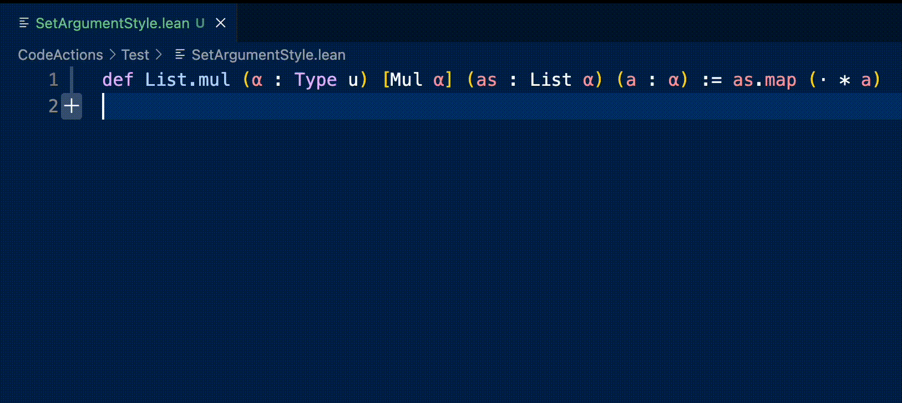

# VSCode Lean 4 Code Actions

<p align="center">
  
</p>

<p align="center" style="padding: 20px 0">
  <a href="https://marketplace.visualstudio.com/items?itemName=denis-gorbachev.lean4-code-actions&ssr=false">
    
  </a>
</p>

## Installation

* [Install the extension](https://marketplace.visualstudio.com/items?itemName=denis-gorbachev.lean4-code-actions&ssr=false)
* Add the keyboard shortcuts for [useful actions](#actions)

Note: a custom language configuration is available as [a separate extension](https://github.com/DenisGorbachev/vscode-lean4-language-configuration#readme).

## Actions

* [Create a new file](#create-a-new-file)
* [Auto-import a definition](#auto-import)
* [Update imports on rename](#update-imports-on-rename)
* [Set argument style](#set-argument-style)
* [Extract a definition to a separate file](#extract-a-definition-to-a-separate-file)
* [Find-replace the current word within a code block](#find-replace-the-current-word-within-a-code-block)
* [Convert a text block to a list of strings](#convert-a-text-block-to-a-list-of-strings)

**Disclaimer:** the commands currently operate directly on text. As such, they have many limitations - for example, sometimes they don't properly detect Lean names. We have plans to reimplement the commands as proper code actions within LSP that operate on `Syntax` instead of text.

## Snippets

* `imp` - expands to [configured imports](#configuration-options)
* `op` - expands to [configured opens](#configuration-options)
* `ns` - expands to `namespace ${currentFileName}`
* `nsp` - expands to `namespace ${currentFilePath}`
* `var` - expands to `variable (${name} : ${Type})`
* `ind` - expands to `inductive` declaration
* `struct` - expands to `structure` declaration
* `cls` - expands to `class` declaration

## Configuration options

* `lean4CodeActions.registerRenameProvider` - use this extension as a rename provider for `.lean` files
* `lean4CodeActions.updateImportsOnFileRename` - update imports in other files when a file is renamed
* `lean4CodeActions.namespace.prefix` - a prefix for top-level namespaces in generated code (added as `${prefix}.${body}`)
* `lean4CodeActions.createNewFile.imports` - a list of Lean filenames to be imported.
* `lean4CodeActions.createNewFile.opens` - a list of Lean namespaces to be opened.
* `lean4CodeActions.createNewFile.derivings` - a list of Lean names to be derived.
* `lean4CodeActions.defaultLib` - default library to be used when creating a new file.

## Related work

* [Std](https://github.com/leanprover/std4) already contains some [code actions](https://github.com/leanprover/std4/tree/main/Std/CodeAction)

### Create a new file


**Before:**

(Nothing)

**After:**

File: `CodeActions/Test/CreateNewFile/User.lean`

```lean
namespace CodeActions.Test.CreateNewFile

structure User where

deriving Repr, Inhabited

namespace User
```

**Notes:**

* This command supports adding `import`, `open` and `deriving instance` commands via [configuration](#configuration-options).

---

### Auto-import


**Before:**

```lean
def x : Rat := 1.0
```

**After:**

```lean
import Std.Data.Rat.Basic

def x : Rat := 1.0
```

**Gotchas:**

* If you execute this command with an empty selection (just a cursor on the name), then only the part captured by [`getWordRangeAtPosition`](https://code.visualstudio.com/api/references/vscode-api#TextDocument.getWordRangeAtPosition) will be used. To import a hierarchical name, select it fully, then execute the command. Alternatively, you can enable detection of hierarchical names by installing [a custom language configuration](https://marketplace.visualstudio.com/items?itemName=denis-gorbachev.lean4-language-configuration).

---

### Update imports on rename


When you rename a file (or move it to another folder), it updates the imports in other files.

**Before:**

File 1: `CodeActions/Test/UpdateImports/Child.lean`

```lean
namespace CodeActions.Test.UpdateImports.Child

def x : Nat := 1
```

File 2: `CodeActions/Test/UpdateImports/Parent.lean`

```lean
import CodeActions.Test.UpdateImports.Child

namespace CodeActions.Test.UpdateImports.Parent

def y : Nat := 2 * Child.x
```

**After:**

File 1: `CodeActions/Test/UpdateImports/Nested/RenamedChild.lean`

```lean
namespace CodeActions.Test.UpdateImports.Child

def x : Nat := 1
```

File 2: `CodeActions/Test/UpdateImports/Parent.lean`

```lean
import CodeActions.Test.UpdateImports.Nested.RenamedChild

namespace CodeActions.Test.UpdateImports.Parent

def y : Nat := 2 * Child.x
```

**Notes:**

* This is a listener, not a command - it is executed automatically upon a file rename. It works even if you rename a file via another extension ([File Utils](https://marketplace.visualstudio.com/items?itemName=sleistner.vscode-fileutils), [File Bunny](https://marketplace.visualstudio.com/items?itemName=robole.file-bunny)).
* It doesn't update the namespaces (should be done manually).
* It can be disabled by setting `lean4CodeActions.updateImportsOnFileRename` to `false`

---

### Set argument style



**Before:**

```lean
(α : Type u)
```

**After:**

```lean
{α : Type u}
```

**Notes:**

* The command supports four argument styles: [explicit](https://leanprover.github.io/theorem_proving_in_lean4/dependent_type_theory.html#function-abstraction-and-evaluation), [implicit strong](https://leanprover.github.io/theorem_proving_in_lean4/dependent_type_theory.html#implicit-arguments), [implicit weak](https://leanprover.github.io/theorem_proving_in_lean4/interacting_with_lean.html?#more-on-implicit-arguments), [typeclass](https://leanprover.github.io/theorem_proving_in_lean4/type_classes.html) (`()`, `{}`, `⦃⦄`, `[]`).

---

### Extract a definition to a separate file


**Before:**

File 1: `CodeActions/Test/ExtractDefinition/Book.lean`

```lean
namespace CodeActions.Test.ExtractDefinition

structure Author where
  name : String

structure Book where
  authors : List Author 
```

**After:**

File 1: `CodeActions/Test/ExtractDefinition/Book.lean`

```lean
import CodeActions.Test.ExtractDefinition.Author

namespace CodeActions.Test.ExtractDefinition

structure Book where
  authors : List Author 
```

File 2: `CodeActions/Test/ExtractDefinition/Author.lean`

```lean
namespace CodeActions.Test.ExtractDefinition

structure Author where
  name : String

namespace Author
```

**How it works:**

* It extracts a definition into a separate file
* It adds an import to the original file

**Gotchas:**

* It doesn't add the `open` command yet

---

### Find-replace the current word within a code block


**Before:**

```lean
def foo : IO String := do
  let text ← IO.FS.readFile "/tmp/secrets"
  return text
```

**After:**

```lean
def foo : IO String := do
  let secrets ← IO.FS.readFile "/tmp/secrets"
  return secrets
```

You can use it to rename a local binding (if the variable name is a unique string of characters across the code block).

**Gotchas:**

* It's a simple find-replace: it doesn't distinguish between variables and text within strings, for example.
* It's activated via "Rename Symbol" native command. If it causes problems, you can disable it by setting `lean4CodeActions.registerRenameProvider` to `false` in the extension configuration.
* It relies on [`getWordRangeAtPosition`](https://code.visualstudio.com/api/references/vscode-api#TextDocument.getWordRangeAtPosition) to detect the word under cursor. You can improve the detection by installing [a custom language configuration](https://marketplace.visualstudio.com/items?itemName=denis-gorbachev.lean4-language-configuration).

**Notes:**

* A code block is defined as a continuous list of non-blank lines.

---

### Convert a text block to a list of strings


**Before:**

```text
foo
bar
xyz
```

**After:**

```text
"foo",
"bar",
"xyz"
```

Each line becomes an element of the list.
